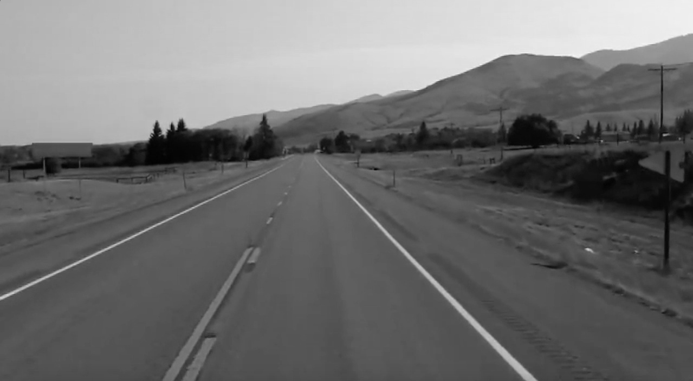

# Repository Overview 
This repository contains Python code for self-driving cars that use computer vision and deep learning techniques to address problems that autonomous vehicles face, such as detecting lane lines and predicting steering angles in real-time.


## Project Setup

### OpenCV


OpenCV stands for “Open Source Computer Vision” is a library for computer vision and machine learning software library. OpenCV has C++, Python, Java and MATLAB interfaces and supports Windows, Linux, Android, and Mac OS. 

## Use OpenCV to Load Image 
The cv2.imread() method loads an image from the specified file. We read the .jpg file as an RGB image. If the image cannot be read (because of missing file, improper permissions, unsupported or invalid format) then this method returns an empty matrix.

```python
image = cv2.imread('/data/Lane_Original.jpg')
```
### Original Image


In a real-life scenario, an autonomous vehicle would process a video instead of an image, but for the sake of learning, we demonstrate how to detect the lanes in a particular image first. 

## Apply Edge Detection Algorithm to Image
The Canny Edge Detector is an edge detection operator that uses a multi-stage algorithm to detect a wide range of edges in images

```python
def detect_edges(image):
    grayscale_image = cv2.cvtColor(image, cv2.COLOR_RGB2GRAY)    
    blurred_image = cv2.GaussianBlur(grayscale_image, (5,5), 0)
    edges = cv2.Canny(blurred_image, 50, 150)  
    return edges   
```

### Convert RGB Image to Grayscale
Before applying the lane detection algorithm to our image, we need to convert the RGB Image to a Grayscale Image because the Canny Detection Algorithm can only be applied on a 2-Dimensional Image.

```python
grayscale_image = cv2.cvtColor(image, cv2.COLOR_RGB2GRAY)    
```


Essentially, we are reducing the complexity of the image by transforming a 3D Array (RGB Image) into a 2D Array (Grayscale Image). 


# STEP 3: USE LANE EDGES TO DEFINE REGION OF INTEREST #
# STEP 4: ISOLATE REGION OF INTEREST IN THE IMAGE
# STEP 5: USE HOUGH TRANSFORM TO FIND LANE LINES 
# STEP 6: OPTIMIZE LANE LINES 

## Download Road Image
https://github.com/rslim087a/road-image

## Install OpenCV Libary in Terminal:
$ pip install opencv-contrib-python


